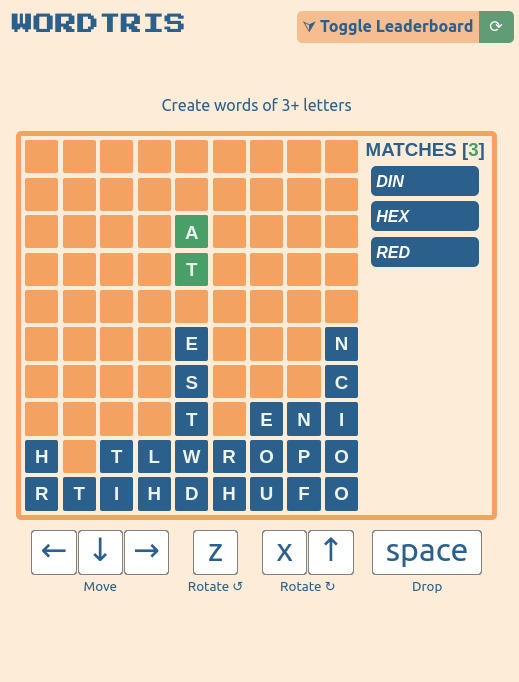
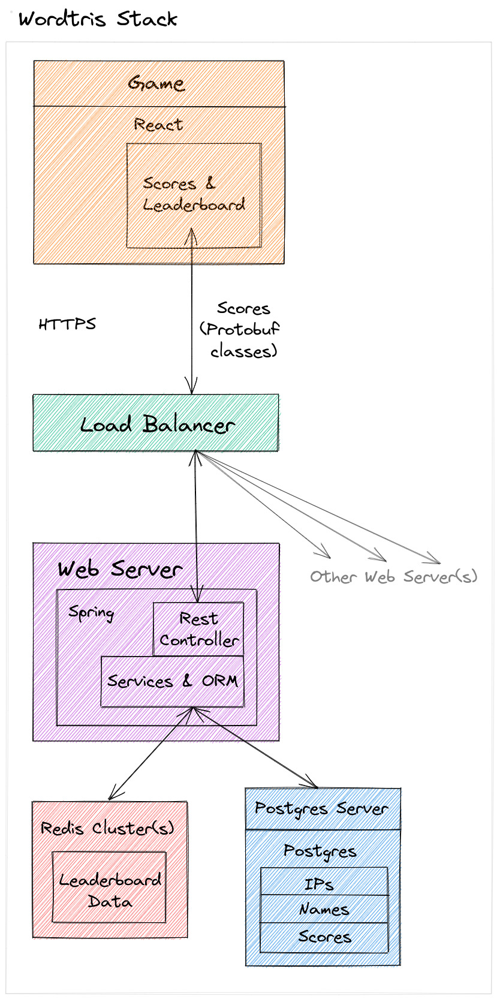

# Tetris + words!

(✿◠‿◠) [Play here!](https://khivy.github.io/wordtris/) ✧♡(◕‿◕✿) (It works on mobile!!)  
Update: The leaderboard server is now shut off because I can no longer pay for it 😓



# Deploying the server
First set any environment vars described in `wordtris-server/docker-compose.yml`

Then make sure your Redis and Postgres server(s) are configured.

Lastly run the following:
```shell
docker-compose up -d
```
Note: it may take a while due to the Docker image building a new .jar. If you intend to run the above command 
multiple times I recommend following the comments in the `wordtris-server/Dockerfile`.

# Systems Diagram


# Development
For contributing, I recommend using the following to hot reload the server:
```sh
./gradlew build --continuous --info
```
And in separate terminal run:
```sh
./gradlew bootRun
```

# Roadmap

- Fix non-determinism bugs
- Look into using more suitable dictionary
